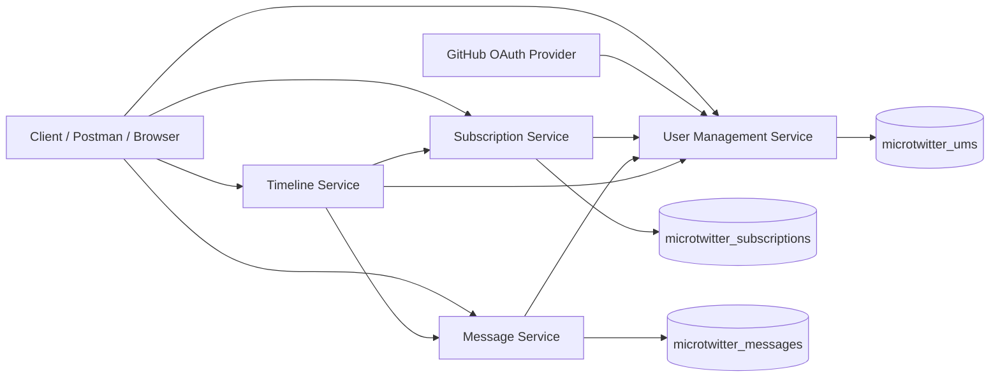

# MicroTwitter Platform

Spring Boot microservices platform that combines user management, subscriptions, messaging, timeline aggregation, and an OAuth 2.0 / JWT-enabled authentication variant in a single GitHub-friendly repository.

This repository packages the semester work into a clean monorepo with Docker-based deployment, GitHub Actions CI, Postman collections, and documentation that makes the project easy to review, run, and extend.

## Table of Contents

- [Why this repository exists](#why-this-repository-exists)
- [Highlights](#highlights)
- [Technology Stack](#technology-stack)
- [Architecture Overview](#architecture-overview)
- [Service Catalog](#service-catalog)
- [Security Model](#security-model)
- [Quick Start](#quick-start)
- [Run the Original Local-Auth UMS Variant](#run-the-original-local-auth-ums-variant)
- [End-to-End Demo Flow](#end-to-end-demo-flow)
- [GitHub OAuth 2.0 Demo](#github-oauth-20-demo)
- [Postman](#postman)
- [CI/CD](#cicd)
- [Running Services Locally Without Docker](#running-services-locally-without-docker)
- [Documentation](#documentation)
- [Honest Production Readiness Notes](#honest-production-readiness-notes)

## Technology Stack

- Java 17
- Spring Boot 2.7
- Spring WebFlux
- Spring Data JPA
- Spring Security OAuth 2.0 Client
- MySQL 8
- Docker Compose
- GitHub Actions
- Postman


## Why this repository exists

The original coursework was delivered as separate milestones:

- a four-service MicroTwitter-style microservices platform
- an OAuth 2.0 enhanced User Management Service

This repository turns those milestones into one coherent platform showcase. The default deployment runs the most advanced version of the system: the four-service platform backed by the OAuth-enabled User Management Service. An overlay file is also included to switch back to the original local-auth version of UMS when needed.

## Highlights

- four independently deployable Spring Boot services
- separate MySQL persistence per bounded context
- UUID session-token validation across services
- GitHub OAuth 2.0 login in the advanced UMS variant
- JWT issuance and JWT inspection endpoint in the advanced UMS variant
- Docker Compose deployment for the full stack
- GitHub Actions CI workflow for every service
- Postman collections for fast API verification

## Architecture Overview



## Service Catalog

| Service | Port | Responsibility | Backing Store | Key Endpoints |
|---|---:|---|---|---|
| User Management Service | `8081` | users, roles, login, logout, token validation, optional GitHub OAuth 2.0, JWT inspection | `microtwitter_ums` | `/api/v1/auth/*`, `/api/v1/users/*`, `/api/v1/internal/*` |
| Subscription Service | `8082` | subscribe, unsubscribe, replace subscriptions, query producer relationships | `microtwitter_subscriptions` | `/api/v1/subscriptions/*`, `/api/v1/internal/*` |
| Message Service | `8083` | publish, list, search, and delete messages | `microtwitter_messages` | `/api/v1/messages/*`, `/api/v1/internal/messages/*` |
| Timeline Service | `8084` | assemble a subscriber feed by calling Subscription and Message services | none | `/api/v1/timeline/subscriber/{subscriberUserId}` |

## Security Model

The platform uses a central User Management Service for authentication and role resolution.

### Original semester variant

- local username/password login
- UUID token generation
- internal token validation endpoint for downstream services

### Advanced OAuth variant

- everything in the original variant
- GitHub OAuth 2.0 login initiation at `/api/v1/auth/login/github`
- GitHub account synchronization into the UMS database
- JWT issuance for demonstration and inspection
- token expiration tracking in the `user_tokens` table

### Current role model

- `PRODUCER` can publish messages
- `SUBSCRIBER` can create and manage subscriptions
- `ADMIN` can delete users and access cross-user administrative paths
- authenticated users can query their own timeline and user context

## Seeded Demo Users

| Username | Password | Roles |
|---|---|---|
| `alice` | `password123` | `PRODUCER`, `SUBSCRIBER` |
| `bob` | `password123` | `SUBSCRIBER` |
| `carol` | `password123` | `PRODUCER` |
| `admin` | `password123` | `ADMIN` |

## Repository Structure

```text
.
├── .github/workflows/ci.yml
├── compose.yaml
├── compose.local-auth.yaml
├── db/
│   ├── messages/
│   ├── subscriptions/
│   └── ums/
├── docs/
│   ├── DEPLOYMENT.md
│   └── GITHUB_SETUP.md
├── k8s/legacy-db-manifests/
├── postman/
├── services/
│   ├── message-service/
│   ├── oauth-user-management-service/
│   ├── subscription-service/
│   ├── timeline-service/
│   └── user-management-service/
├── Makefile
└── SECURITY.md
```

## Quick Start

### 1. Prepare environment

```bash
cp .env.example .env
```

### 2. Start the default stack

The default stack uses the OAuth-enabled User Management Service and keeps local login available for testing.

```bash
docker compose up --build -d
docker compose ps
```

### 3. Open the platform

- UMS landing page: `http://localhost:8081`
- UMS API base: `http://localhost:8081/api/v1`
- Subscription API: `http://localhost:8082/api/v1`
- Message API: `http://localhost:8083/api/v1`
- Timeline API: `http://localhost:8084/api/v1`

### 4. Shut the stack down

```bash
docker compose down
```

For a full reset:

```bash
docker compose down -v --remove-orphans
```

## Run the Original Local-Auth UMS Variant

If you want to demonstrate the earlier milestone version of the User Management Service:

```bash
docker compose -f compose.yaml -f compose.local-auth.yaml up --build -d
```

This swaps the OAuth-enabled UMS implementation for the original local-auth implementation while leaving the rest of the platform unchanged.

## End-to-End Demo Flow

### Login as Alice

```bash
curl -s -X POST http://localhost:8081/api/v1/auth/login \
  -H "Content-Type: application/json" \
  -d '{"username":"alice","password":"password123"}'
```

Save the returned `token` as `ALICE_TOKEN`.

### Login as Bob

```bash
curl -s -X POST http://localhost:8081/api/v1/auth/login \
  -H "Content-Type: application/json" \
  -d '{"username":"bob","password":"password123"}'
```

Save the returned `token` as `BOB_TOKEN`.

### Alice publishes a message

```bash
curl -s -X POST http://localhost:8083/api/v1/messages \
  -H "Content-Type: application/json" \
  -H "X-Auth-Token: ${ALICE_TOKEN}" \
  -d '{"content":"Hello from Alice inside the MicroTwitter platform."}'
```

### Bob subscribes to Alice

```bash
curl -s -X POST http://localhost:8082/api/v1/subscriptions \
  -H "Content-Type: application/json" \
  -H "X-Auth-Token: ${BOB_TOKEN}" \
  -d '{"producerUserId":1}'
```

### Bob reads his timeline

```bash
curl -s http://localhost:8084/api/v1/timeline/subscriber/2 \
  -H "X-Auth-Token: ${BOB_TOKEN}"
```

## GitHub OAuth 2.0 Demo

The default deployment is ready for GitHub OAuth once you provide credentials in `.env`.

### GitHub OAuth application settings

- Homepage URL: `http://localhost:8081`
- Authorization callback URL: `http://localhost:8081/login/oauth2/code/github`

### Required environment variables

```dotenv
GITHUB_CLIENT_ID=your-client-id
GITHUB_CLIENT_SECRET=your-client-secret
JWT_SECRET=a-long-random-secret
```

### Start the OAuth flow

Open either:

- `http://localhost:8081`
- `http://localhost:8081/api/v1/auth/login/github`

On successful login, the service returns a JSON payload that includes:

- a UUID session token
- a JWT token
- expiry metadata
- role information
- the authentication source

## Postman

Import the following files from the `postman/` directory:

- `MicroTwitter.postman_collection.json`
- `UMS_OAuth.postman_collection.json`
- `MicroTwitter.docker.postman_environment.json`

## CI/CD

A GitHub Actions workflow is included at `.github/workflows/ci.yml`.

Current CI behavior:

- runs on pushes to `main` and on pull requests
- sets up Java 17
- builds each service independently with Maven
- caches Maven dependencies

This repository currently focuses on build verification. It is designed to be extended with:

- automated test execution
- container image publishing
- staged deployments
- vulnerability scanning

## Running Services Locally Without Docker

The original local semester configuration has been preserved in each service `application.yml`.

Local service ports:

- User Management Service: `8081`
- Subscription Service: `8082`
- Message Service: `8083`
- Timeline Service: `8084`

Local database ports:

- UMS MySQL: `33061`
- Subscriptions MySQL: `33062`
- Messages MySQL: `33063`

Recommended manual startup order:

1. databases
2. UMS
3. subscription-service
4. message-service
5. timeline-service

## Documentation

- [Deployment Guide](docs/DEPLOYMENT.md)
- [GitHub Setup Guide](docs/GITHUB_SETUP.md)
- [Security Notes](SECURITY.md)

## Honest Production Readiness Notes

This repository is intentionally presented in an enterprise-style format, but the business logic reflects semester project scope. Before calling it production-ready, the following upgrades should be made:

- replace SHA-256 password hashing with BCrypt or Argon2
- move secrets out of `.env` and into a secret manager
- add an API gateway and centralized configuration
- add integration tests and contract tests
- add container image scanning and dependency scanning
- add structured logging, tracing, and metrics
- introduce service-to-service trust beyond plain internal HTTP

## Why this repository works well on GitHub

- it tells one coherent architecture story
- it keeps the original and enhanced authentication milestones together
- it can be started with one command
- it gives reviewers both code and runnable deployment assets
- it is organized for portfolio review, demos, and future extension
